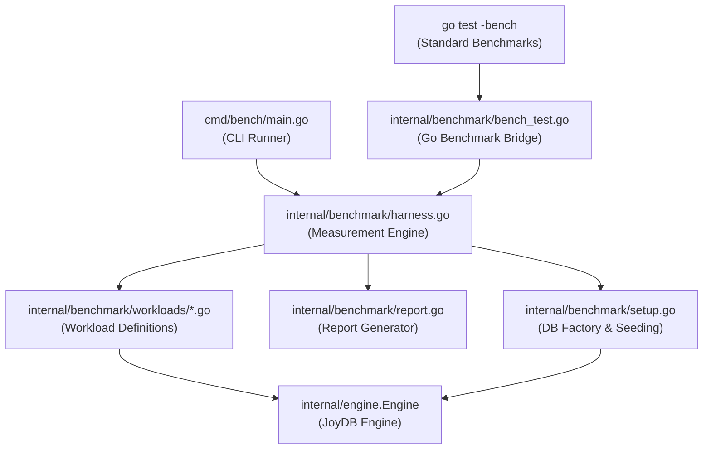

# Phase 2: Database Benchmarking Suite

## Overview

Build a standalone, extensible benchmarking suite for JoyDB that measures core database performance metrics. The suite must establish baselines **before** Phase 3–5 changes and continuously track regressions as the engine evolves. It is designed as a dedicated `internal/benchmark` package using Go's native `testing.B` framework plus a custom harness for richer output (JSON reports, percentile latencies, comparison mode).

## Why This Design

Rather than bolting one-off benchmark scripts, we build a **layered architecture** that separates:

1. **Workload definitions** (what SQL to run) — easily extended for new features
2. **Harness infrastructure** (how to measure) — timing, statistics, reporting
3. **Runner/CLI** (how to invoke) — `go test -bench`, Makefile targets, and a standalone `cmd/bench` entry

This means when Phase 3 adds WAL buffering or Phase 5 adds row-level locking, you just add new workload files without touching the harness.

## Architecture



---

## Proposed Changes

### Benchmark Infrastructure (`internal/benchmark/`)

#### [NEW] [harness.go](file:///c:/Users/lee.ngari/projects/JoyDb/internal/benchmark/harness.go)

The core measurement engine. Provides:

- **`BenchmarkHarness`** struct — holds an `engine.Engine`, configuration, and result collectors
- **`RunWorkload(w Workload, opts RunOptions) *WorkloadResult`** — executes a workload with warm-up iterations, timed iterations, and cooldown
- **Timing** — uses `time.Now()` nanosecond precision per operation, collects individual latencies into a `[]time.Duration` slice
- **Statistics** — computes p50, p90, p95, p99 latencies, mean, stddev, ops/sec (TPS), and total elapsed
- Designed so Phase 3/4/5 workloads can reuse the same harness without modification

```go
type RunOptions struct {
    WarmupIterations  int           // Iterations to run before measuring
    Iterations        int           // Measured iterations (0 = auto-calibrate like testing.B)
    Duration          time.Duration // Alternative: run for this duration
    Concurrency       int           // No-op scaffold (default: 1). Activated in Phase 5 for row-level locking benchmarks.
    ResetBetweenRuns  bool          // Re-seed the database between runs
}

type WorkloadResult struct {
    Name        string
    Latencies   []time.Duration
    TotalTime   time.Duration
    Iterations  int
    Stats       Stats  // p50, p90, p95, p99, mean, stddev, ops/sec
    Errors      int
    Metadata    map[string]interface{} // Workload-specific data
}
```

#### [NEW] [workload.go](file:///c:/Users/lee.ngari/projects/JoyDb/internal/benchmark/workload.go)

The `Workload` interface — the extension point for all future benchmarks:

```go
type Workload interface {
    Name() string
    Description() string
    Setup(eng *engine.Engine) error   // Prepare tables/data for this workload
    Run(eng *engine.Engine, iter int) error // Execute a single iteration
    Teardown(eng *engine.Engine) error
    Tags() []string                   // e.g. ["write", "insert", "single-row"]
}
```

Tags allow filtering: `--tags=write`, `--tags=read,index` etc.

#### [NEW] [setup.go](file:///c:/Users/lee.ngari/projects/JoyDb/internal/benchmark/setup.go)

Database factory for benchmarks:

- **`NewBenchEngine(opts EngineOptions) *engine.Engine`** — creates a fresh in-memory engine with optional WAL disabled (for pure engine benchmarks) or enabled (for WAL benchmarks)
- **`SeedTable(eng, tableName, schema, rowCount)`** — bulk-seeds a table with deterministic test data using the engine's `Execute()` method
- **Data generators** — `RandomInt`, `RandomText(len)`, `RandomEmail`, `SequentialID` — provide reproducible data with a fixed seed for deterministic comparisons

```go
type EngineOptions struct {
    WALEnabled  bool
    BasePath    string   // Empty = t.TempDir() / os.MkdirTemp
    DBName      string
}
```

#### [NEW] [report.go](file:///c:/Users/lee.ngari/projects/JoyDb/internal/benchmark/report.go)

Report generation:

- **`Report`** struct — holds `[]WorkloadResult` plus environment metadata (Go version, OS, CPU count, timestamp, JoyDB git commit hash)
- **`Report.WriteJSON(w io.Writer)`** — machine-readable output for trend tracking
- **`Report.WriteText(w io.Writer)`** — human-readable table (aligned columns with latency stats)
- **`CompareReports(baseline, current *Report) *Comparison`** — shows % change per workload, flags regressions > 10%

Sample text output:
```
┌────────────────────────────┬───────────┬──────────┬──────────┬──────────┬──────────┬──────────┐
│ Workload                   │ Ops/sec   │ p50      │ p90      │ p95      │ p99      │ Mean     │
├────────────────────────────┼───────────┼──────────┼──────────┼──────────┼──────────┼──────────┤
│ insert_single_row          │ 48,230    │ 18.2µs   │ 24.1µs   │ 31.5µs   │ 89.4µs   │ 20.7µs   │
│ select_pk_lookup           │ 312,450   │ 2.8µs    │ 3.9µs    │ 5.1µs    │ 12.3µs   │ 3.2µs    │
│ select_full_scan_1k        │ 8,920     │ 98.3µs   │ 142.1µs  │ 178.0µs  │ 310.2µs  │ 112.1µs  │
│ update_by_pk               │ 25,140    │ 35.2µs   │ 48.7µs   │ 62.1µs   │ 125.8µs  │ 39.8µs   │
│ delete_by_pk               │ 22,810    │ 38.9µs   │ 52.3µs   │ 67.2µs   │ 140.1µs  │ 43.8µs   │
│ join_nested_loop_1k_x_1k   │ 45        │ 21.2ms   │ 24.8ms   │ 26.1ms   │ 30.5ms   │ 22.1ms   │
│ mixed_read_write_80_20     │ 31,200    │ 28.4µs   │ 42.1µs   │ 55.3µs   │ 112.7µs  │ 32.0µs   │
└────────────────────────────┴───────────┴──────────┴──────────┴──────────┴──────────┴──────────┘
```

---

### Workload Definitions (`internal/benchmark/workloads/`)

Each file defines one or more `Workload` implementations. This is the part that grows as JoyDB evolves.

#### [NEW] [insert.go](file:///c:/Users/lee.ngari/projects/JoyDb/internal/benchmark/workloads/insert.go)

| Workload | Description | Tags |
|---|---|---|
| `InsertSingleRow` | Insert one row per iteration into a 4-column table (INT PK auto-increment, TEXT, FLOAT, BOOL). Measures raw insert throughput including validation, B+Tree insert, hash index update, and WAL logging. | `write`, `insert`, `single-row` |
| `InsertBulk100` | Insert 100 rows per iteration. Measures amortized insert cost. | `write`, `insert`, `bulk` |
| `InsertWithFK` | Insert into a child table with a foreign key referencing a parent. Measures FK validation overhead. | `write`, `insert`, `fk` |

#### [NEW] [select.go](file:///c:/Users/lee.ngari/projects/JoyDb/internal/benchmark/workloads/select.go)

| Workload | Description | Tags |
|---|---|---|
| `SelectPKLookup` | Point lookup by primary key on a 10K-row table. Exercises B+Tree `Search()`. | `read`, `select`, `index`, `pk` |
| `SelectFullScan1K` | `SELECT * FROM t` on a 1K-row table. Measures sequential scan throughput. | `read`, `select`, `scan` |
| `SelectFullScan10K` | `SELECT * FROM t` on a 10K-row table. | `read`, `select`, `scan` |
| `SelectWithPredicate` | `SELECT * FROM t WHERE amount > 500.0` on 10K rows. Measures predicate evaluation overhead. | `read`, `select`, `filter` |
| `SelectWithProjection` | `SELECT id, name FROM t` on 10K rows. Measures projection overhead. | `read`, `select`, `projection` |

#### [NEW] [update.go](file:///c:/Users/lee.ngari/projects/JoyDb/internal/benchmark/workloads/update.go)

| Workload | Description | Tags |
|---|---|---|
| `UpdateByPK` | Update a single row by PK predicate. Measures predicate + in-place update + full index rebuild cost. | `write`, `update`, `single-row` |
| `UpdateBulk` | Update 100 rows matching a range predicate. | `write`, `update`, `bulk` |

#### [NEW] [delete.go](file:///c:/Users/lee.ngari/projects/JoyDb/internal/benchmark/workloads/delete.go)

| Workload | Description | Tags |
|---|---|---|
| `DeleteByPK` | Delete a single row by PK. Measures delete + array compaction + full index rebuild. | `write`, `delete`, `single-row` |
| `DeleteBulk` | Delete 10 rows per iteration. | `write`, `delete`, `bulk` |

> [!IMPORTANT]
> Delete benchmarks need special handling: each iteration deletes rows, so the table shrinks. The harness must re-seed between runs (`ResetBetweenRuns: true`) to keep measurements consistent.

#### [NEW] [join.go](file:///c:/Users/lee.ngari/projects/JoyDb/internal/benchmark/workloads/join.go)

| Workload | Description | Tags |
|---|---|---|
| `JoinNestedLoop100x100` | JOIN two 100-row tables via nested loop. Establishes baseline for small joins. | `read`, `join`, `nested-loop` |
| `JoinNestedLoop1Kx1K` | JOIN two 1K-row tables. Shows O(n²) scaling. | `read`, `join`, `nested-loop` |

#### [NEW] [mixed.go](file:///c:/Users/lee.ngari/projects/JoyDb/internal/benchmark/workloads/mixed.go)

| Workload | Description | Tags |
|---|---|---|
| `MixedReadWrite80_20` | 80% reads (PK lookup) / 20% writes (insert). Simulates a realistic OLTP-like workload pattern. | `mixed`, `oltp` |
| `MixedReadWrite50_50` | 50% reads / 50% writes. Stress test. | `mixed`, `oltp` |

#### [NEW] [ddl.go](file:///c:/Users/lee.ngari/projects/JoyDb/internal/benchmark/workloads/ddl.go)

| Workload | Description | Tags |
|---|---|---|
| `CreateDropTable` | Create + Drop a table per iteration. Measures DDL overhead including WAL schema logging. | `ddl`, `schema` |

#### [NEW] [wal.go](file:///c:/Users/lee.ngari/projects/JoyDb/internal/benchmark/workloads/wal.go)

| Workload | Description | Tags |
|---|---|---|
| `InsertWithWAL` | Same as InsertSingleRow but explicitly WAL-enabled. Allows comparison: WAL on vs WAL off. | `write`, `wal` |
| `InsertNoWAL` | Same insert but with WAL disabled. Establishes the WAL overhead delta. | `write`, `no-wal` |

> [!TIP]
> After Phase 3 (WAL buffering, segmentation), re-running these two workloads immediately shows the performance impact of the WAL improvements.

---

### Scaling Benchmarks (`internal/benchmark/workloads/scaling.go`)

#### [NEW] [scaling.go](file:///c:/Users/lee.ngari/projects/JoyDb/internal/benchmark/workloads/scaling.go)

These benchmarks run the same operation at different table sizes to reveal algorithmic complexity:

| Workload | Sizes | What it reveals |
|---|---|---|
| `InsertScaling` | 100, 1K, 10K, 100K rows | B+Tree insert degradation (should be O(log n)) |
| `SelectScanScaling` | 100, 1K, 10K, 100K rows | Sequential scan is O(n) — confirms linear growth |
| `SelectPKScaling` | 100, 1K, 10K, 100K rows | B+Tree lookup should stay O(log n) |
| `DeleteScaling` | 100, 1K, 10K rows | Index rebuild cost dominates — should show O(n log n) |

---

### Go Benchmark Bridge (`internal/benchmark/`)

#### [NEW] [bench_test.go](file:///c:/Users/lee.ngari/projects/JoyDb/internal/benchmark/bench_test.go)

Bridges all workloads to Go's `testing.B` so they integrate with `go test -bench`:

```go
func BenchmarkInsertSingleRow(b *testing.B) {
    h := NewHarness(DefaultEngineOptions())
    w := workloads.NewInsertSingleRow()
    h.RunGoBench(b, w)
}

func BenchmarkSelectPKLookup(b *testing.B) { ... }
func BenchmarkSelectFullScan1K(b *testing.B) { ... }
// ... one function per workload
```

This lets you run: `go test -bench=. -benchtime=5s ./internal/benchmark/...`

---

### CLI Runner

#### [NEW] [main.go](file:///c:/Users/lee.ngari/projects/JoyDb/cmd/bench/main.go)

Standalone benchmark runner with richer output than `go test -bench`:

```
Usage:
  joydb-bench [flags]

Flags:
  --tags string       Filter workloads by tags (comma-separated)
  --iterations int    Number of iterations per workload (default: auto)
  --duration duration Run each workload for this duration (default: 3s)
  --warmup int        Warmup iterations (default: 100)
  --json              Output results as JSON
  --output string     Write results to file (default: stdout)
  --baseline string   Compare against a baseline JSON report
  --wal               Enable WAL for benchmarks (default: false)
  --concurrency int   Concurrent workers — no-op scaffold, always 1 (default: 1)
```

Example usage:
```bash
# Run all benchmarks, save baseline
go run ./cmd/bench --json --output baseline_v1.json

# After Phase 3 changes, compare
go run ./cmd/bench --json --output phase3.json --baseline baseline_v1.json
```

---

### Makefile Integration

#### [MODIFY] [Makefile](file:///c:/Users/lee.ngari/projects/JoyDb/Makefile)

Add benchmark targets:

```makefile
# Run Go benchmarks (quick, standard output)
bench:
	go test -bench=. -benchmem -benchtime=3s ./internal/benchmark/...

# Run full benchmark suite with rich output
bench-full:
	go run ./cmd/bench --duration 5s

# Run benchmarks and save JSON baseline
bench-baseline:
	go run ./cmd/bench --json --output benchmarks/baseline.json --duration 5s

# Compare against baseline
bench-compare:
	go run ./cmd/bench --json --baseline benchmarks/baseline.json --duration 5s
```

---

## Extensibility Points

This design is built to grow with JoyDB. Here's how each future phase adds to it:

| Future Phase | What to add | Where |
|---|---|---|
| **Phase 3: WAL buffering** | `InsertWithBufferedWAL` workload comparing old vs new WAL write path | `workloads/wal.go` |
| **Phase 3: WAL segmentation** | `RecoveryBenchmark` — measure WAL replay time for segmented vs single file | `workloads/wal.go` |
| **Phase 4: Index range scans** | `SelectRangeScan` — `WHERE id > X AND id < Y` comparing seq scan vs B+Tree range | `workloads/select.go` |
| **Phase 4: Multi-way JOINs** | `ThreeWayJoin` — join 3 tables, measure planner overhead | `workloads/join.go` |
| **Phase 4: Aliases** | No benchmark needed (parser-only change) | — |
| **Phase 5: Tombstones** | `DeleteWithTombstone` vs current array-shift delete | `workloads/delete.go` |
| **Phase 5: Row-level locking** | Activate the scaffolded `Concurrency` field — set `Concurrency: N` on mixed workloads to measure lock contention | `workloads/mixed.go` + `harness.go` |

---

## Resolved Decisions

| Decision | Resolution |
|---|---|
| **Row count defaults** | **10K rows** confirmed as the default "medium" table size. Individual workloads may use smaller sizes (100, 1K) where noted, but 10K is the standard. |
| **CI integration** | **Local-only** for now. No GitHub Actions / CI pipeline needed. Baselines are saved locally as JSON files and compared manually via `--baseline` flag. |
| **Concurrency scaffolding** | **No-op scaffold now.** The `Concurrency` field is present in `RunOptions` and the `--concurrency` CLI flag is accepted, but the harness always runs single-threaded (ignores values > 1). Phase 5 activates it by adding goroutine dispatch in the harness. |

---

## File Summary

| Path | Status | Purpose |
|---|---|---|
| `internal/benchmark/harness.go` | NEW | Core measurement engine |
| `internal/benchmark/workload.go` | NEW | Workload interface definition |
| `internal/benchmark/setup.go` | NEW | Engine factory + data seeding |
| `internal/benchmark/report.go` | NEW | JSON/text report generation + comparison |
| `internal/benchmark/bench_test.go` | NEW | Go `testing.B` bridge |
| `internal/benchmark/workloads/insert.go` | NEW | Insert workloads |
| `internal/benchmark/workloads/select.go` | NEW | Select/read workloads |
| `internal/benchmark/workloads/update.go` | NEW | Update workloads |
| `internal/benchmark/workloads/delete.go` | NEW | Delete workloads |
| `internal/benchmark/workloads/join.go` | NEW | Join workloads |
| `internal/benchmark/workloads/mixed.go` | NEW | Mixed read/write workloads |
| `internal/benchmark/workloads/ddl.go` | NEW | DDL benchmarks |
| `internal/benchmark/workloads/wal.go` | NEW | WAL on/off comparison |
| `internal/benchmark/workloads/scaling.go` | NEW | Table-size scaling analysis |
| `cmd/bench/main.go` | NEW | Standalone CLI runner |
| `Makefile` | MODIFY | Add bench targets |

---

## Verification Plan

### Automated Tests
1. **Compilation**: `go build ./internal/benchmark/... ./cmd/bench/...` — must compile cleanly
2. **Go benchmarks**: `go test -bench=. -benchtime=1s -count=1 ./internal/benchmark/...` — all benchmarks run without error
3. **CLI runner**: `go run ./cmd/bench --duration 1s --json` — produces valid JSON report
4. **Comparison mode**: Run twice, compare reports — no crashes, % change computed correctly

### Manual Verification
1. Review text report output formatting — aligned columns, readable latencies
2. Run insert-with-WAL vs insert-no-WAL — confirm WAL overhead is visible (~2-5x)
3. Run scaling benchmarks — confirm O(log n) for PK lookups, O(n) for scans
